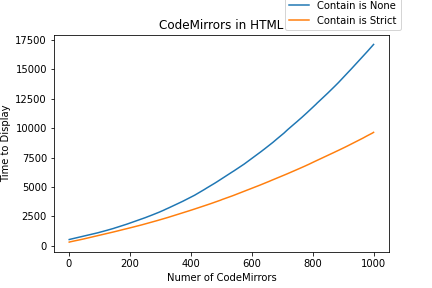

import { Head, Appear, Image, withDeck } from 'mdx-deck'
import { Invert, Split, SplitRight } from 'mdx-deck/layouts'
import { CodeSurfer } from 'mdx-deck-code-surfer'

# JupyterLab Performance Fixes

<Head>
  <title>Finding the Root Causes of the Issues</title>
</Head>

[https://github.com/jupyterlab/benchmarks](https://github.com/jupyterlab/benchmarks)

Navigate with ➡️

Preview mode with `Option`+`P`

<small>November 3, 2020</small>

---

<Split>
  <div>
    
    
    <p>Exponential time adding CodeMirrors</p>
  </div>
</Split>

---

export default Invert

# Causes in the Frontend

## Not in the Backend!

<Appear>
  <p>Forced Layout on each CodeMirror addition</p>
  <p>Lumino Panel slows down</p>
</Appear>

```notes
...
```

---

export default Invert

# Fixes

<Appear>
  <p>1️⃣ Virtual Notebook</p>
  <p>2️⃣ DeLayout Rendering</p>
  <p>3️⃣ Fix Lumino or DeLumino</p>
  <p>4️⃣ Tune or Fix Code Mirror</p>
  <p>5️⃣ Service or Web Workers</p>
</Appear>

```notes
...
```

---

# Small Notebook Lifecyle


---

# Medium Notebook Lifecyle


---

# 1️⃣ Virtual Notebook

### Render the first 10 cells and placeholders for the rest

### Lazy render the rest

<ul style={{listStyle: 'none'}}>
  <li>👍 Notebook loads faster (90% faster for very large notebooks)</li>
  <li>❗ User is impacted by the Forced Layout while scrolling and notebook still renders</li>
  <li>❓ Alternative: Only render cells in the visible area with a <em>Window</em></li>
</ul>

---

<CodeSurfer
  code={require("raw-loader!./snippets/virtual-notebook.ts")} 
  title="Notebook Constructor"
  showNumbers={false}
  steps={[
    {}, // First step should be an overview of the snippet
    {range: [5,12], notes: "Render and unobserve"},
    {}
  ]}
/>

```notes
...
```

---

<SplitRight>

<div>
  
  <h1>2️⃣ DeLayout Rendering</h1>
  <Appear>
    <p>Render all cells with <em>contain: strict</em></p>
    <p>👍 Avoid repetitive Force Layout</p>
    <p>Mutate all content with <em>contain: none</em></p>
    <p>👍 A single Forced Layout instead of many</p>
    <h3>➡️ 40% faster for 1000 cells on a single page</h3>
  </Appear>
</div>

</SplitRight>

---

# 3️⃣ Fix Lumino or DeLumino

#### 1000 JupyterLab Cells: 50 seconds.

#### 1000 JupyterLab Cells in a Lumino BoxPanel: 10 seconds for DOMContentLoaded, cells are only shown after 140 seconds.

---

# 4️⃣ Tune or Fix Code Mirror

#### Tune CodeMirror configuration

#### Fix CodeMirror source code

---

# 5️⃣ Service or Web Workers

#### Bring more Concurrency

---

export default Invert

# Thank You!

[https://github.com/jupyterlab/benchmarks](https://github.com/jupyterlab/benchmarks)
