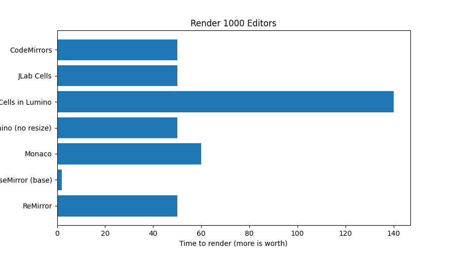
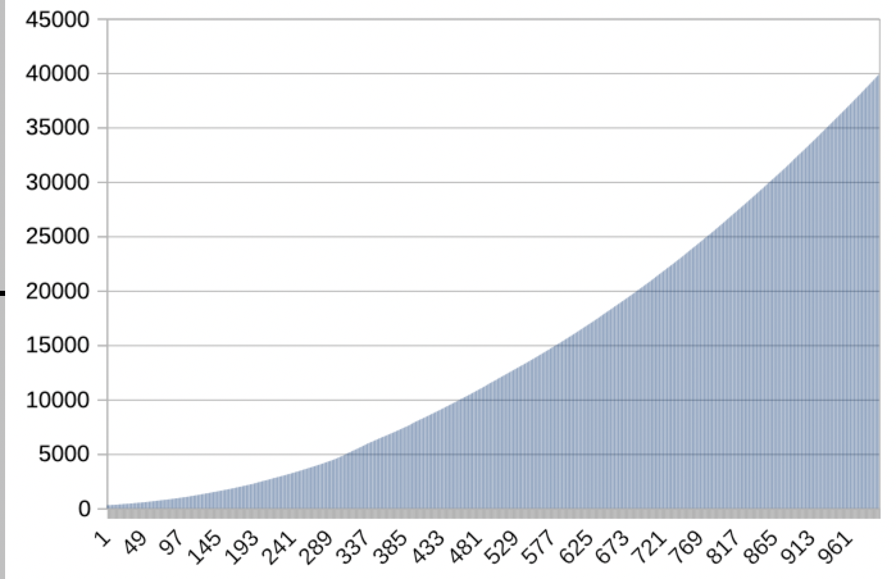
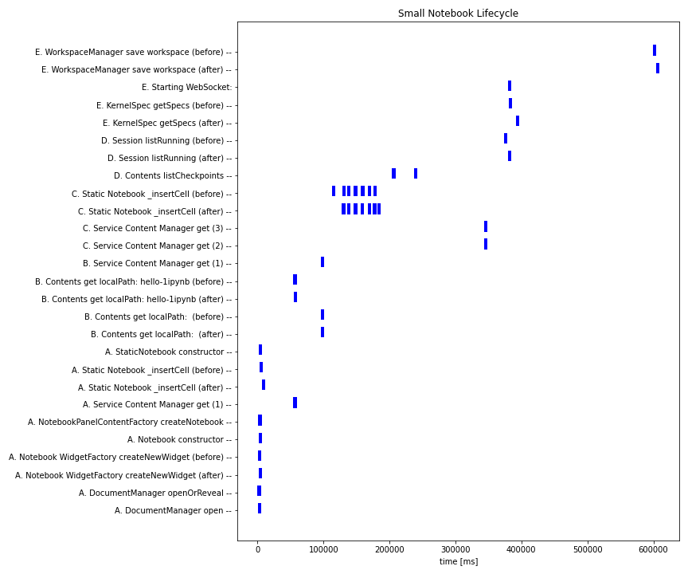
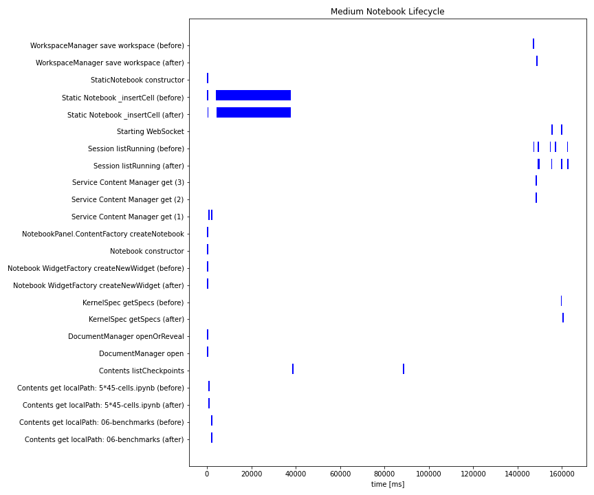
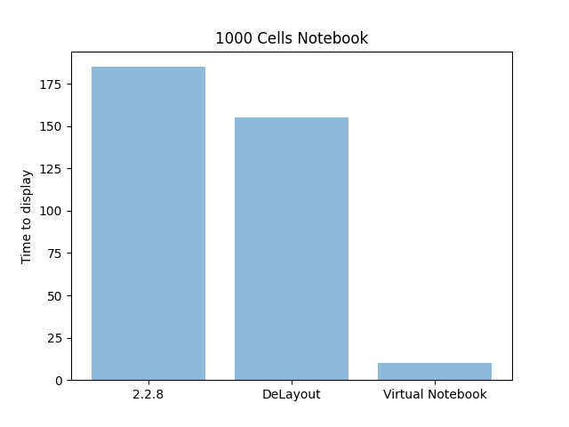
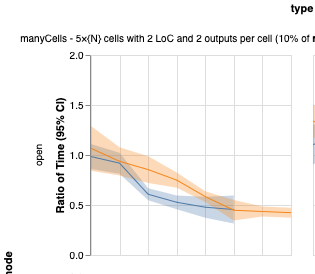
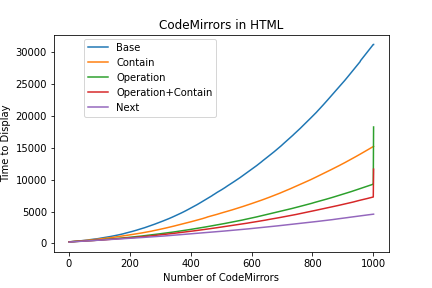
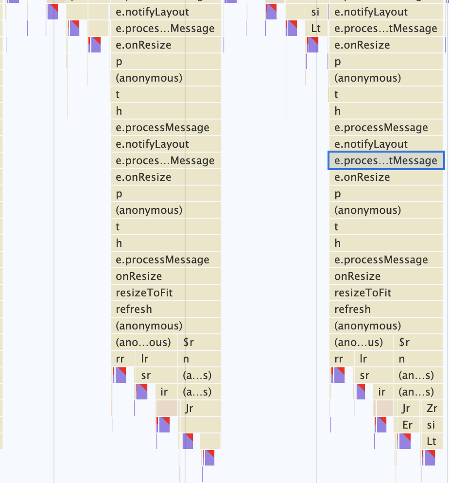

import { Head, Appear, Image, withDeck } from 'mdx-deck'
import { Invert, Split, SplitRight } from 'mdx-deck/layouts'
import { CodeSurfer } from 'mdx-deck-code-surfer'

# JupyterLab Performance Fixes

<Head>
  <title>Finding the Root Causes of the Issues</title>
</Head>

[https://github.com/jupyterlab/benchmarks](https://github.com/jupyterlab/benchmarks)

Navigate with ➡️

Preview mode with `Option`+`P`

<small>November 10, 2020</small>

---

<Split>
  <div>
    
    
    <p>Exponential time adding CodeMirrors</p>
  </div>
</Split>

---

# Small Notebook Lifecyle



---

# Medium Notebook Lifecyle



---

<Image src='images/profiling-forced-layout.png' />

---

export default Invert

# Causes in the Frontend

## Backend not covered here!

<Appear>
  <p style={{color: 'yellow'}}>Forced Layout on each CodeMirror addition</p>
  <p style={{color: 'yellow'}}>Lumino Panel slows down</p>
</Appear>

```notes
...
```

---

export default Invert

<SplitRight>

<div>
  
  <h1>Fixes</h1>
  <Appear>
    <p>1️⃣ Virtual Notebook</p>
    <p>2️⃣ 🏃 DeLayout Rendering</p>
    <p>3️⃣ 🏃 Stripped Output</p>
    <p>4️⃣ 🏃 Tune or Fix Code Mirror</p>
    <p>5️⃣ 🏃 Fix Lumino</p>
    <p>6️⃣ 🚧 Service or Web Workers</p>
  </Appear>
</div>

</SplitRight>

```notes
...
```

---

# 1️⃣ Virtual Notebook

### Render the first 10 cells and placeholders for the rest

### Lazy render the rest

<ul style={{listStyle: 'none'}}>
  <li style={{marginBottom: 50}}>👍 Notebook loads faster (90% faster for very large notebooks)</li>
  <li style={{marginBottom: 50}}>❗ User is impacted by the Forced Layout while scrolling and notebook still renders</li>
  <li>⚙️ Set <em>renderOnIdle</em> to <em>false</em></li>
  <li>⚙️ Alternative: Only render cells in the visible area with a <em>Window</em></li>
</ul>

---

<CodeSurfer
  code={require("raw-loader!./snippets/virtual-notebook.ts")} 
  title="FYI Notebook Constructor"
  showNumbers={false}
  steps={[
    {}, // First step should be an overview of the snippet
    {range: [5,12], notes: "Render and unobserve"},
    {}
  ]}
/>

```notes
...
```

---

<Split>
  <div>
    <h1>Benchmark on Virtual Notebook</h1>
    <p>Large gains</p>
    
  </div>
</Split>

---

<SplitRight>

<div>
  
  <h1>2️⃣ 🏃 DeLayout Rendering</h1>
  <Appear>
    <p>Render all cells with <em>contain: strict</em></p>
    <p>👍 Avoid repetitive Force Layout</p>
    <p>Mutate all content with <em>contain: none</em></p>
    <p>👍 A single Forced Layout instead of many</p>
    <h3>➡️ Faster for 1000 cells on a single page</h3>
  </Appear>
</div>

</SplitRight>

---

# 3️⃣ 🏃 Stripped Output

#### Only show first and last N lines of the Output

####  Work in Progress

---

<SplitRight>

<div>
  
  <h1>4️⃣ 🏃 Tune or Fix Code Mirror</h1>
  <Appear>
    <p>🤷 Tune CodeMirror configuration</p>
    <p>🤷 Fix CodeMirror source code</p>
    <p>❌ Move to CodeMirror.next - Backward Incompatible</p>
    <p>➡️ Workaround with DeLayout Rendering</p>
  </Appear>
</div>

</SplitRight>

---

<SplitRight>

<div>
  
  <h1>5️⃣ 🏃 Fix Lumino</h1>
  <Appear>
    <p>1000 JupyterLab Cells: 50 seconds.</p>
    <p>1000 JupyterLab Cells in a Lumino BoxPanel</p>
    <p>10 seconds for DOMContentLoaded, cells are only shown after 140 seconds</p>
    <h3>➡️ Disable onResize events</h3>
  </Appear>
</div>

</SplitRight>

---

# 6️⃣ 🚧 Service or Web Workers

#### Bring more Concurrency❗

#### Rendering still the bootleneck...

#### To be combined with 2️⃣ DeLayout Rendering❓

---

# Next Step?

| Fix                     | Workload       | Gain   |
| ----------------------- |:--------------:|:------:|
| Virtual Notebook        | Done           | +++    |
| Virtual Notebook Window | +              | ?      |
| CodeMirror Operation    | +++++          | +      |
| DeLayout                | +              | ++     |
| CodeMirror.next         | +++++++++      | +++    |
| Fix Lumino              | +++            | ++     |
| Service or Web Workers  | ++++++         | ?      |

#### Proposal

1. Tune cells directly rendered in Virtual Notebook (50?)
2. Merge DeLayout
3. Develop and Merge Lumino Fix
4. Release 2.3.0a2

---

<CodeSurfer
  code={require("raw-loader!./snippets/docker.sh")} 
  title="🐳 Try with Docker"
  showNumbers={false}
  steps={[
    {}, // First step should be an overview of the snippet
    {range: [1,7], notes: "Vanilla JupyterLab 2.2.8"},
    {range: [9,15], notes: "Virtual Notebook"},
    {range: [17,23], notes: "Virtual Notebook with a Window"},
    {range: [25,31], notes: "DeLayout"},
    {}
  ]}
/>

---

export default Invert

# Thank You!

[https://github.com/jupyterlab/benchmarks](https://github.com/jupyterlab/benchmarks)
