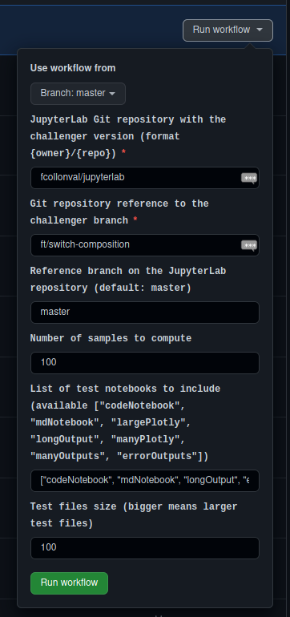

# Benchmarks on CI

You need to start a manual benchmark workflow in the [repository actions](https://github.com/jupyterlab/benchmarks/actions/workflows/benchmark.yml). It will measure the execution of the following scenario: 

- Opening the test notebook
- Switching from the test notebook to a copy of it
- Switching back
- Switching from the test notebook to a text editor
- Switching back
- Search for a word
- Closing the test notebook

There are multiple test notebooks available and their size can be tune with a size parameter.

Those cases will be run on the provided challenger repo/branch and in the reference JupyterLab repo at a given branch. Then it will produce a report that can be downloaded as artifacts when done.

The workflow parameters are:

- JupyterLab Git repo [required]: fork name in format _{owner}/{repo}_
- Git repository reference [required]: typically branch name of a PR
- Reference branch [default: `master`]: Branch on `jupyterlab/jupyterlab` to use a reference
- Number of samples [default: 100]: Number of experiments to run to build the statistical distribution of execution time
- Test notebooks to use [default: `["codeNotebook", "mdNotebook", "longOutput", "errorOutputs"]`]: 
The test notebooks to execute; the available test notebooks are: ["codeNotebook", "mdNotebook", "largePlotly", "longOutput", "manyPlotly", "manyOutputs", "errorOutputs"]
- Test files size [default: 100]: tests notebooks are parametrized with an integer that is proportional to their size. 

> You need to remember that a GitHub job is limited to 6 hours. This means you may need to either reduce the number of samples (be careful) or the list of test notebooks to fit that time span.
> The two JupyterLab versions are tested in the same job to avoid hardware discrepancy.

The notebooks, results and comparisons are uploaded as Github Actions artifacts that you can download from the bottom section `Artifacts` from a specific build of [JupyterLab Benchmark Action](https://github.com/jupyterlab/benchmarks/actions/workflows/benchmark.yml).
