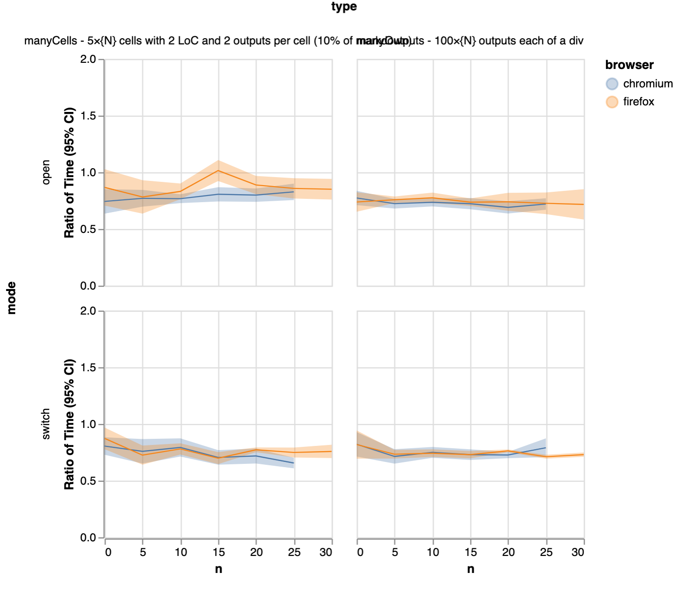

# Fixes

## Block Div

[2.2.x Use block display in Notebook panel](https://github.com/jupyterlab/jupyterlab/pull/8968).

## Content Visibility

[2.2.x Add content-visibility on Cell CSS class](https://github.com/jupyterlab/jupyterlab/pull/8970).

## Virtual Notebook

[2.2.x Virtual notebook](https://github.com/jupyterlab/jupyterlab/pull/8972).

## Server Parsing

[NbFormat: Use fastjsonschema](https://github.com/jupyter/nbformat/pull/191).
