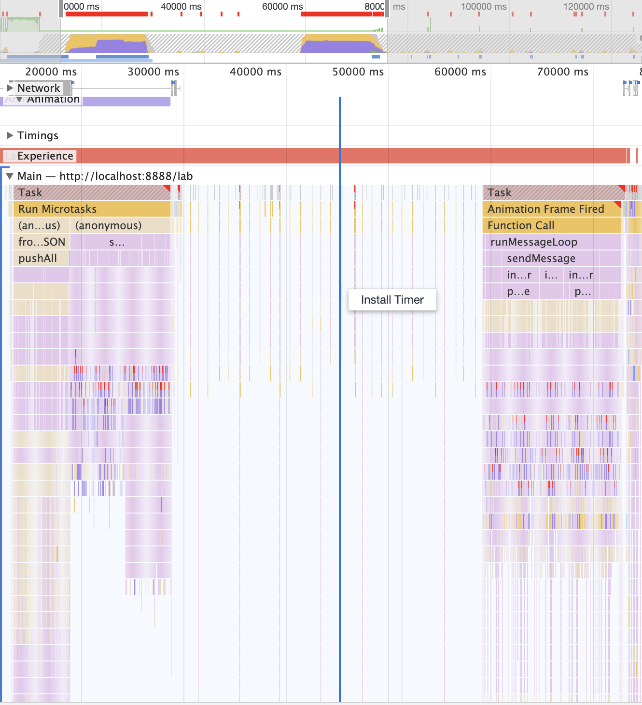
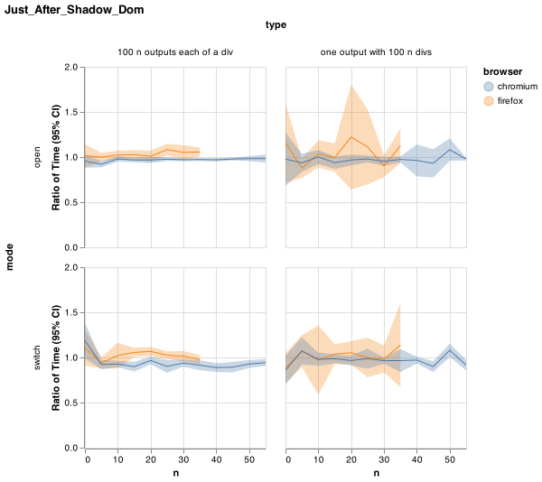

# Fixes

We can identify differents stategies for the fixes.

1. Strategy 1: Strip Output
1. Strategy 2: Adhoc Fix
1. Strategy 3: Virtualized Rendering
1. Strategy 4: DOM Optimization
1. Strategy 5: Web Workers
1. Strategy 6: React Optimization
1. Strategy 7: Browser Configuration

Whatever the fix, we want to ensure:

- `Search` functionality is still working like before

## Strategy 1: Strip Outputt

We could strip the cell output if too the ouput is too large.

However, tthis does not work for graphical outputs and does not provide any fix for the code editor which is the largest identified performance offender so far.

## Strategy 2: Adhoc Fix

We can think to adhoc fixes.

One way to get adhoc fix would be to further look at `updateEditorOnShow` implemented in [jupyterlab/jupyterlab#5700](https://github.com/jupyterlab/jupyterlab/issues/5700), but [is is already set to false...](https://github.com/jupyterlab/jupyterlab/blob/71f07379b184d5b0b8b67b55163d27194a61a0ac/packages/notebook/src/widget.ts#L493).

Other adhoc fix to optimize some code sections.

### Adhoc Fix Attempt 1 - Use requestAnimationFrame (non concluding)

Wrapped the cell creation into a requestAnimationFrame call. This produces a different profile pattern (2 heavy sections separated by an inactive one). The Forced layout due to codemirror are still there.



```javascript
requestAnimationFrame(() => {
    const cellDB = this._factory.modelDB!;
    const cellType = cellDB.createValue(id + '.type');
    let cell: ICellModel;
    switch (cellType.get()) {
        case 'code':
        cell = this._factory.createCodeCell({ id: id });
        break;
        case 'markdown':
        cell = this._factory.createMarkdownCell({ id: id });
        break;
        default:
        cell = this._factory.createRawCell({ id: id });
        break;
    }
    this._cellMap.set(id, cell);
});
```

### Adhoc Fix Attempt 2 - Use pushAll cells (non concluding)

We have updated the [celllist#pushAll](https://github.com/jupyterlab/jupyterlab/blob/7d1e17381d3ed61c23c189822810e8b4918d57ba/packages/notebook/src/celllist.ts#L333-L341) code block but it has not brought better performance.

Current attempts have not brought enhancements.

### Adhoc Fix Attempt 3 - Reuse contentFactory in Notebook Model

We may try to benchmark with this patch. At first user try, this does not give sensible change.

```
diff --git a/packages/notebook/src/model.ts b/packages/notebook/src/model.ts
index 2efeee7b3..4716ce9f7 100644
--- a/packages/notebook/src/model.ts
+++ b/packages/notebook/src/model.ts
@@ -514,7 +514,7 @@ export namespace NotebookModel {
      *   `codeCellContentFactory` will be used.
      */
     createCodeCell(options: CodeCellModel.IOptions): ICodeCellModel {
-      if (options.contentFactory) {
+      if (!options.contentFactory) {
         options.contentFactory = this.codeCellContentFactory;
       }
       if (this.modelDB) {
```

### Adhoc Fix Attempt 4 - scrollbarStyle: 'null' to the Editor Config

On this [comment](https://github.com/jupyterlab/jupyterlab/issues/4292#issuecomment-674419945): I did some quick experiments, based on some quick profiling results (it seems that the vast majority of time is in browser layout). For example, adding scrollbarStyle: 'null' to the bare editor config in [editor.ts](https://github.com/jupyterlab/jupyterlab/blob/7d1e17381d3ed61c23c189822810e8b4918d57ba/packages/codemirror/src/editor.ts#L1374).

We should benchmark this change.

### Adhoc Fix Attempt 5 - CodeMirror Configuration

We should look how to configure or even update CodeMirror code base to mitigate the numerous Force layout:

- On this [comment](https://github.com/jupyterlab/jupyterlab/issues/4292#issuecomment-674419945): Also editing the codemirror source to avoid measurements (by manually returning what the cached values ended up being) at <https://github.com/codemirror/CodeMirror/blob/83b9f82f411274407755f80f403a48448faf81d0/src/measurement/position_measurement.js#L586> and <https://github.com/codemirror/CodeMirror/blob/83b9f82f411274407755f80f403a48448faf81d0/src/measurement/position_measurement.js#L606> seemed to help a bit. The idea here is that since a single codemirror seems okay, but many codemirrors does not (even when the total number of lines is the same), perhaps we can use measurements from the codemirror to shortcut measurements in all the others, which seem to be causing lots of browser layout time.
- Read also discussion on [CodeMirror/#/5873](https://github.com/codemirror/CodeMirror/issues/5873).

## Strategy 3: Virtualized Rendering

Cocalc has been [using react-virtualized](https://github.com/sagemathinc/cocalc/pull/3969).

We should look at this to understand how this could help.

Virtualization complexity and potential side-effects (search...) have to be taken into account.

### Intersection Observer

We can think to more generic fixes like using [Intersection Observer API](https://developer.mozilla.org/en-US/docs/Web/API/Intersection_Observer_API).

Useful links.

- [Intersection Observer API](https://developer.mozilla.org/en-US/docs/Web/API/Intersection_Observer_API)
- [Intersection Observer API - Timing](https://developer.mozilla.org/en-US/docs/Web/API/Intersection_Observer_API/Timing_element_visibility)
- [React Intersection Observer](https://github.com/thebuilder/react-intersection-observer)
- https://react-intersection-observer.now.sh
- https://webdesign.tutsplus.com/tutorials/how-to-intersection-observer--cms-30250
- https://css-tricks.com/a-few-functional-uses-for-intersection-observer-to-know-when-an-element-is-in-view

The strategy would be:

- Use an intersection observer to only render cells (input + output) on screen on page load.
- As there are free cycles, render the rest of the notebook.
- Ideally do this from the closest cell to the furthest.
- If any cell is in view, it loads.
- All non-loaded cells will need a cheap div that takes approx the same amount of space and has clear loading text.
- Add UI elements to indicate a notebook is still loading so that users don't search and not find something on the page.
- Do not load any notebook that is not visible (i.e. when you open a workspace and have notebooks that are not visible, they should not be rendered).

### React Virtualized / Windowing

An preliminary step is to wrap Notebook into React (see this PR [Try Notebok React component](https://github.com/jupyterlab/benchmarks/issues/15).

Then we could use React virtualisation libraries.

- [Creating More Efficient React Views with Windowing - ForwardJS San Francisco](https://www.youtube.com/watch?v=t4tuhg7b50I)
- [Rendering large lists with React Virtualized](https://www.youtube.com/watch?v=UrgfPjX97Yg)
- [React Virtualized](https://github.com/bvaughn/react-virtualized)
- [React Window](https://github.com/bvaughn/react-window)
- [Rendering large lists with react-virtualized or react-window](https://www.youtube.com/watch?v=QhPn6hLGljU)
- https://addyosmani.com/blog/react-window
- https://github.com/falinsky/tmdb-viewer (react-virtualized) https://tmdb-viewer.surge.sh
- https://github.com/giovanni0918/tmdb-viewer (react-window)
- [React Virtual](https://github.com/tannerlinsley/react-virtual)

## Strategy 4: DOM Optimization

DOM optimization backed by libraries or new browser features

### Shadow DOM

[Shadow DOM](https://developer.mozilla.org/en-US/docs/Web/Web_Components/Using_shadow_DOM) allows `encapsulation — being able to keep the markup structure, style, and behavior hidden and separate from other code on the page so that different parts do not clash, and the code can be kept nice and clean`.

Initial Shadow DOM usage is implemented in [Move CodeMirror HTML tree and related CSS to shadow DOM](https://github.com/jupyterlab/jupyterlab/pull/8584).

```
- f7b7ee7d271bd1233a5b95c9fd9dfb2d9509bbe6
  - Move CodeMirror HTML tree and related CSS to shadow DOM
  - Sun Jul 26 05:33:10 2020 -0500
- 1f15fcbc577517f1f320252bbe0a7b5a48f32996
  - Merge pull request #8642 from saulshanabrook/2.2-changelog
  - Fri Jul 24 16:14:11 2020 -0400
```

We compare `f7b7ee7` vs `1f15fcb` and find that Shadow DOM made switching notebooks slightly faster in Chrome and slightly slower in Firefox.



### Content Visibility

We should try the upcoming [content visibility](https://web.dev/content-visibility) (supported in Chromium 85).

See also [Display Locking library](https://github.com/wicg/display-locking) for the related Display Locking spec.

### Fast DOM

[FastDOM](https://github.com/wilsonpage/fastdom) is a libraary that eliminates layout thrashing by batching DOM measurement and mutation tasks.
 
## Strategy 5: Web Workers

Web Workers makes it possible to run a script operation in a background thread separate from the main execution thread of a web application. The advantage of this is that laborious processing can be performed in a separate thread, allowing the main (usually the UI) thread to run without being blocked/slowed down.

- [Web Workers API](https://developer.mozilla.org/en-US/docs/Web/API/Web_Workers_API)  
- [Service Workers](https://developers.google.com/web/fundamentals/primers/service-workers)  
- [React and Webworkers](https://github.com/facebook/react/issues/3092#issuecomment-333417970)  

## Strategy 6: React Optimization

For React componentts, [React Concurrency](https://reactjs.org/docs/concurrent-mode-intro.html#concurrency) can be used.

## Strategy 7: Browser Configuration

From this [comment](https://github.com/jupyterlab/jupyterlab/issues/4292#issuecomment-674411129).

Webrender for Firefox 79 (for many linux and macos devices, see <https://wiki.mozilla.org/Platform/GFX/WebRender_Where>  can be turned on via a pref. See also <https://www.techrepublic.com/article/how-to-enable-firefox-webrender-for-faster-page-rendering>. Note that windows firefox has had webrender turned on by default in certain cases for a while now.
