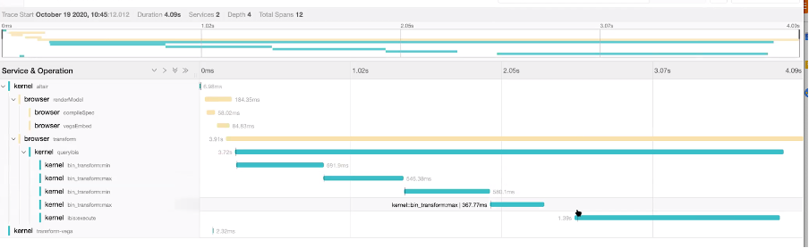

# Jaeger

[Jaeger](https://www.jaegertracing.io) is an open source, end-to-end distributed tracing and can be used as alternative to Jupyter Telemetry. It provides visualization out-of-the-box. Integration with Jupyter is available on <https://github.com/quansight/jupyter-jaeger>

